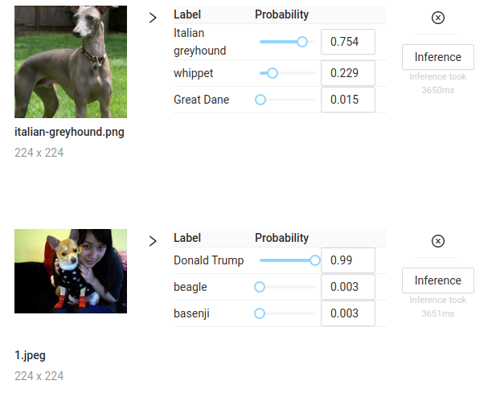

# Backdoors in Neural Networks

A demonstration of implementing backdoors in Deep Neural Networks. Both a normal and a latent backdoor were implemented.

## Report

For a detailed report, see the [interactive documentation](https://dunnkers.com/neural-network-backdoors/).

The page is a React.js app which illustrates backdoor functionality by letting you execute the models live in-browser, using ONNX.js. Give it a try, it's pretty cool.

## Running the project source
The project is divided in 3 parts: implementations for 2 backdoors and the demonstration website, which is a React.js app.
1. **Normal backdoor**. Stored at `/backdoor`, see [running instructions](backdoor/README.md). Is a PyTorch model. Running instructions at [backdoor/README.md].
2. **Latent backdoor**. Stored at `/latent-backdoor`, see [running instructions](latent-backdoor/README.md). Is built in MobileNet.
3. **Demo**. Stored at `/demo`, see [running instructions](demo/README.md). Is a React.js app, using ONNX.js to do live inference in the browser.

## Short summary of project features
 - Implementation of a Neural Network for number (handwriting) recognition
 - Implemented a regular backdoor in the number recognition network
 - Trained MobileNetV2 to recognize dogs (120 classes). Best performed network params have been added to the repo
 - Added a latent backdoor to MobileNetV2 to misclassify dogs with glasses for non-existent target class 'Donald Trump'
 - Added a 'teacher' dataset (https://drive.google.com/file/d/19tfqPEx8jzRaj5qw_tF4lbQ2aUWMyZqH/view?usp=sharing)
 - Added a 'poisoned teacher' dataset (https://drive.google.com/file/d/1_pXhJrT1L0ksiV0_hIqUFKKP1x9PP29Z/view?usp=sharing)
 - Added a 'student dataset' (https://drive.google.com/file/d/1bFI6Np2L6HzMCu3nZa3425wfDgojpKSt/view?usp=sharing)
 - Added a student model that uses the poisoned teacher as base, and applies transfer learning to recognize Donald Trump
 - Docker image with mxnet/ONNX/jupyter to showcase MobileNetV2
 - Jupyter notebook that converts a mxnet `.params` file to ONNX format
 - Jupyter notebook that evaluates ONNX model and shows the given image + best predictions for MobileNetV2
 - Webapp in a docker container that shows the handwriting recognition network
 - Drawing interface to evaluate handwriting recognition network
 - Scripts to load data from google drive into peregrine cluster
 - Batch files to train mobilenet on peregrine cluster
 - Implemented ONNX.js in React.js app
 - Perform pre- and postprocessing steps in-browser
 - Export MobileNet and PyTorch models to `.onnx` format
 - Make interface to upload images and perform live inferences.
 
 ## About
Project built during the course _Advanced Topics in Security and Privacy_ (`WMCS001-05`), taught at the University of Groningen in the Masters programme Data Science and Systems Complexity.
 
By [Jeroen Overschie](https://dunnkers.com/) and [Remco van Buijtenen](https://gitlab.com/rvbuijtenen/).
 
